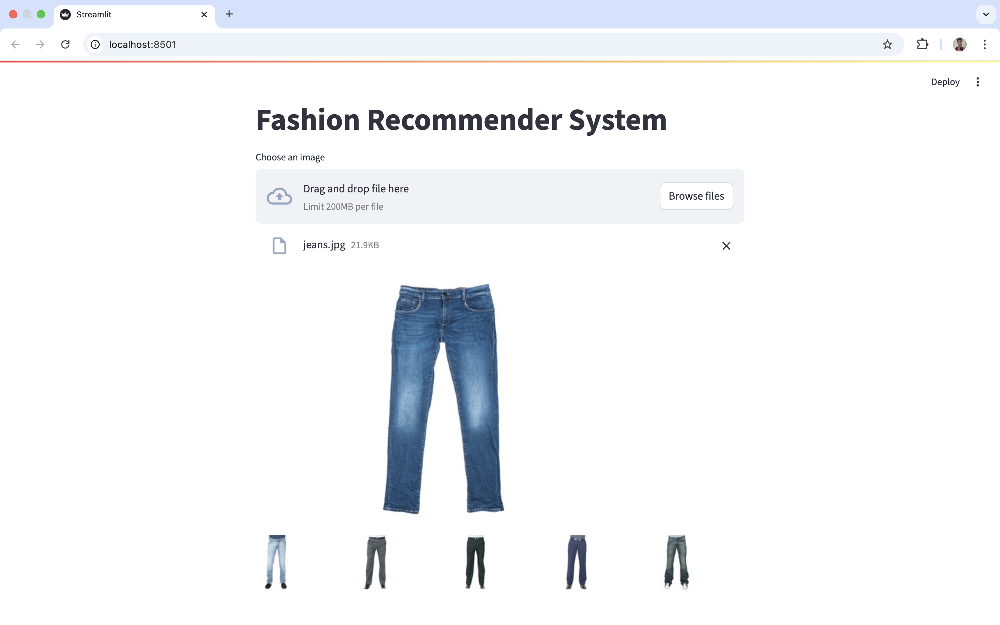
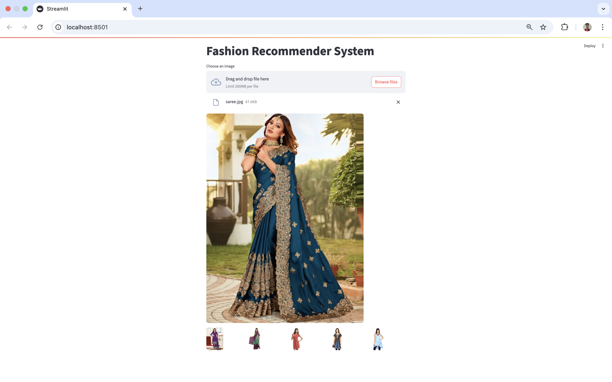
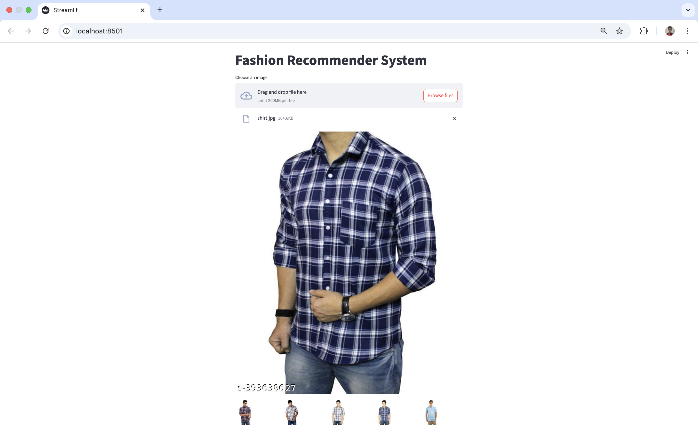
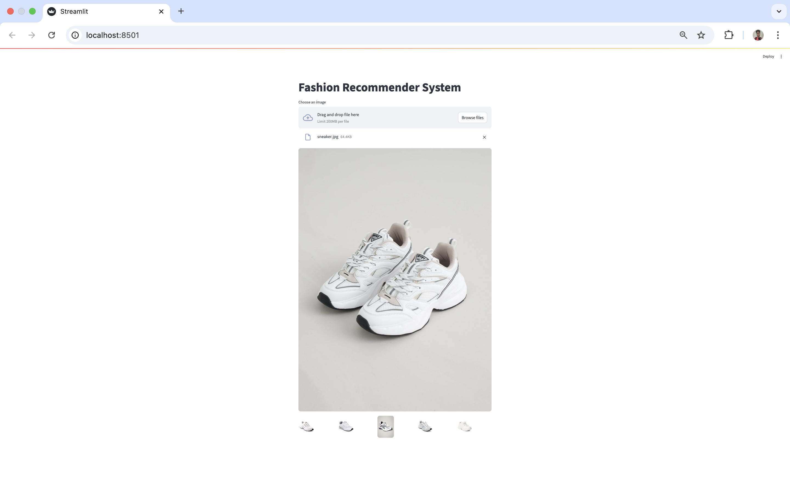

# DeepFashionSearch

DeepFashionSearch is a deep learning–based reverse image search system for fashion. Upload a fashion-related image (like a shirt, dress, or accessory), and the app will recommend 5 visually similar items from a curated dataset of over 44,000 images.

Built using ResNet50 for feature extraction and K-Nearest Neighbors (KNN) for similarity search, the project demonstrates how transfer learning and computer vision can power intelligent visual recommendations.

## Tech Stack

- Python
- TensorFlow + Keras (ResNet50)
- scikit-learn (KNN)
- NumPy
- Streamlit
- Pickle

## How It Works

1. Feature Extraction:
   - Images are passed through a pre-trained ResNet50 model (without the top layer)
   - Extracted embeddings are pooled and normalized

2. Offline Processing:
   - Feature vectors for all 44,000+ images are precomputed and saved using pickle

3. Image Search:
   - When a user uploads a new image, its embedding is extracted
   - The system uses KNN to find the 5 most similar vectors from the dataset

4. Recommendation Output:
   - The top 5 similar images are displayed in a Streamlit interface

## Getting Started

### 1. Clone the repo

git clone https://github.com/yourusername/DeepFashionSearch.git  
cd DeepFashionSearch

### 2. Install dependencies

pip install -r requirements.txt

### 3. Prepare your dataset

- Place your fashion images inside a folder named `images/`

### 4. Run the Streamlit app

streamlit run app.py

## 📁 Project Structure

```
DeepFashionSearch/
├── app.py                  # Streamlit app (handles upload, feature extraction, search)
├── embeddings.pkl          # Saved feature vectors of dataset images
├── filenames.pkl           # Corresponding image file paths
├── images/                 # Folder containing all fashion images (44K+ dataset)
├── requirements.txt        # Project dependencies
└── README.md               # Project description and instructions
```
## 🖼️ Demo Screenshots

Below are a few examples of how DeepFashionSearch works for different fashion items.

### 👖 Jeans


### 👗 Saree


### 👕 Shirt


### 👟 Sneaker



## License

MIT License.

## Acknowledgments

- ImageNet & ResNet authors
- Streamlit
- scikit-learn contributors

## Author

Nishant Kumar  
IIIT Bhopal • SDE/ML Enthusiast  
nishant7896545@gmail.com 
https://github.com/Nishant840
